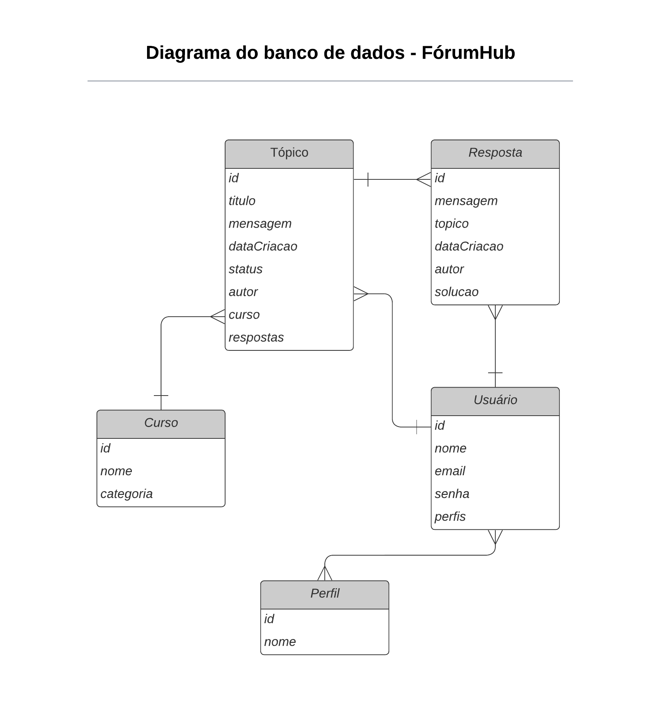

# Forum Hub

## Dependências e Tecnologias

* Java 23
* Spring Boot 3.4.1
* Maven
* Lombok
* Spring Web
* Spring Boot DevTools
* Spring Data JPA
* Flyway Migration
* MySQL Driver
* Spring Validation
* Spring Security
* DevTools
* Json Web Token
* Spring Doc

## Tabelas

As tabelas e relacionamentos foram realizadas com base no esquema fornecido pelo desafio:




## Desafio Alura

Para o desafio Alura, será focado no CRUD relacionado a Tópicos. Para isso foi criado um primeiro usuário que recebe administrador que futuramente será levado em conta para mais funcionalidades da API.

```
INSERT INTO usuarios (nome, email, senha, admin, ativo)
VALUES
('DBA', 'DBA@forumhub.com', '$2a$12$9UmbuOR5GjdkiDba8ovrAu4.WqKrXKKWhLNXDq1tboSLNra3qdLr.', 1, 1);
```

Além disso foram preenchidos valores nas demais tabelas para garantir a criação de diversas instancias de tópicos.

```
INSERT INTO alura_challenge.cursos (nome, categoria)
VALUES
('Java e Orientação a Objetos', 'BACK_END'),
('Java e Spring Framework', 'FULLSTACK'),
('Iniciante em Programação', 'FRONT_END');
```

Uma vez conectado, foram realizadas requisitoes post até completar um número suficiente de dados para testar a paginação. Verificar [requisicoes_postman](postman/requisicoes_postman.json)

Além do CRUD, algumas regras foram adicionadas para os tópicos - (implementação futura. Não fazem parte do desafio alura):
ABERTO - qualquer um pode continuar postando
FECHADO - Aberto para leitura mas não para postagem
DESATIVADO - Exclusão lógica. Não podem ser acessados.

## Swagger
uma vez que o projeto está rodando a documentação pode ser acessada em (AMBIENTE LOCAL):
* Requisições Swagger - http://localhost:8080/swagger-ui/index.html#/
* Endpoints Swagger - http://localhost:8080/v3/api-docs

Detalhes dos endpoints podem ser visualizados em [api-docs.json](swagger/api-docs.json)